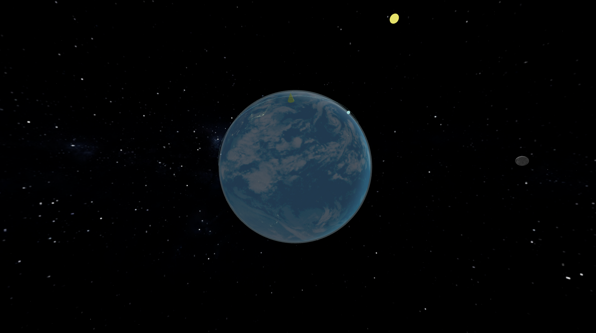

# Real-Time Earth & Satellite Visualization

A real-time 3D Earth visualization built with **React Three Fiber** that accurately simulates:

- Day / night cycle aligned with **real UTC time**
- Sun-position–correct lighting
- City night lights
- Animated cloud layer
- Real-time satellite tracking (ISS via TLE)
- Starfield background with Milky Way
- Physically correct Earth rotation (GMST)

---

## Screenshot

> _Screenshot showing real-time day/night terminator, clouds, and satellite orbit._

---

## Features

- **Astronomically correct Sun position**
- **Camera-independent lighting** (no fake shading)
- **Smooth day/night terminator**
- **Night lights only on Earth’s dark side**
- **UTC-aligned Earth rotation**
- **ISS position updated in real time**
- **Simple, performant shaders**

---

## Tech Stack

- **Next.js / React**
- **@react-three/fiber**
- **three.js**
- **Custom GLSL shaders**
- **TLE-based satellite propagation**

---
